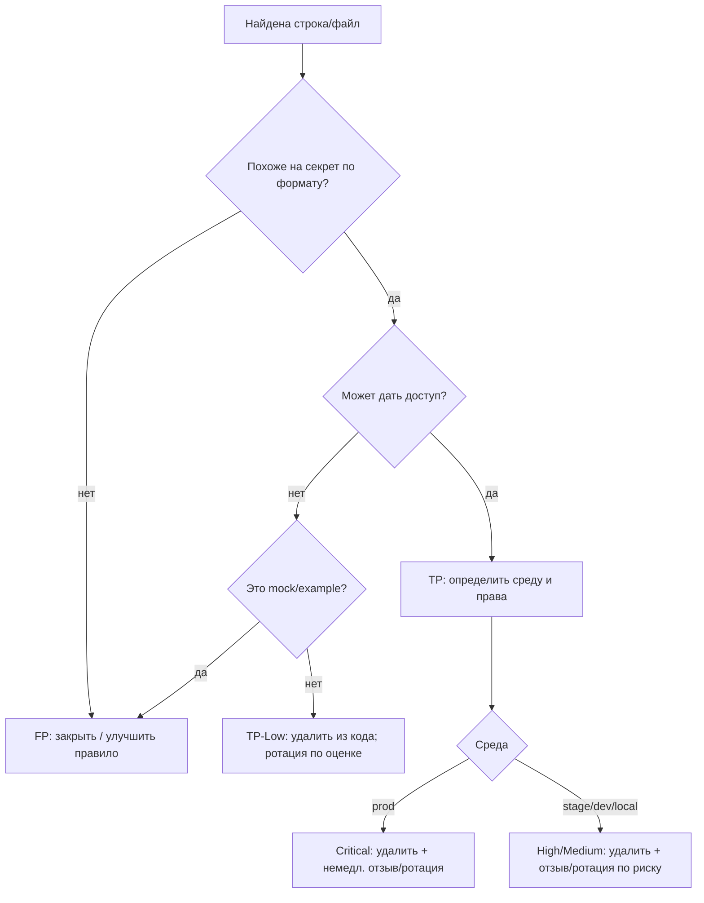

# Инструкция по работе с секретами для разработчиков

## Executive summary
Секреты (ключи/токены/пароли/криптоматериалы) **нельзя** хранить в git: ни в коде, ни в `test/`, ни в `docs/`, ни “временно”. Управление секретами должно быть централизовано: выдача на runtime, минимизация прав, аудит и ротация. citeturn0search0  
Если секрет **хоть раз был запушен в удалённый репозиторий**, он считается потенциально скомпрометированным; простое удаление из HEAD не решает проблему, потому что данные остаются доступными в истории/клонах, и требуется контролируемая процедура. citeturn0search3turn0search24  

**Политика (2 строки)**  
Запрещено коммитить секреты любого типа и для любой среды, включая test/mock.  
Найденный секрет удаляется из HEAD немедленно и подлежит отзыву/ротации по процедуре.

Ключевая идея для команд: **AppSec фиксирует и валидирует**, разработка **устраняет в коде**, DevOps/владельцы систем **ротируют/отзывают в источнике секрета**.

## Область применения и определения
**Применимость:** все репозитории, ветки, PR, артефакты CI, шаблоны конфигурации и примеры.  

**Секрет** — значение или файл, который даёт доступ (аутентификация/авторизация), позволяет подписывать/расшифровывать или управлять инфраструктурой. Рекомендация OWASP — централизовать хранение и управление, чтобы снижать вероятность утечек и упрощать ротацию/аудит. citeturn0search0  

**Важно:** системы тикетов/сканеры (ASOC/Jira/почта) **не** являются секрет‑хранилищем; в них не публикуются значения секретов (см. шаблоны triage ниже).

## Классификация секретов и сред
### Классификация по среде
Среда влияет на срочность и ущерб, но **не** отменяет запрет хранения в git.

| Среда | Значение | Минимальное требование |
|---|---|---|
| prod | продуктивные данные/доступ | немедленный отзыв/ротация при утечке |
| stage/test | стенды | как минимум High: часто есть реальные интеграции/данные |
| dev | общая разработка | секреты только вне git, минимальные права |
| local | машина разработчика | секреты только локально (`.env`, env vars), в `.gitignore` |
| mock/example | заглушка | допускаются только **невалидные** заглушки |

### Полная классификация типов (из ваших алертов)
Примеры ниже **вымышленные/маскированы/намеренно испорчены**, чтобы не быть рабочими и не подходить под “боевые” форматы.

| Тип (Gitleaks заголовки) | Категория | Пример (безопасный) |
|---|---|---|
| private key | криптоматериал | `-----BEGIN PRIVAT3 K3Y----- … (redacted) … -----END PRIVAT3 K3Y-----` |
| pkcs12-file (.p12/.pfx) | криптоматериал | `keystore.exampl3.p12` |
| JWT | токен | `JWT=<base64url>.<base64url>.<signature>` |
| service account token | токен (K8s) | “JWT с `iss: kubernetes/serviceaccount`” citeturn0search1 |
| vault service token | токен | `VAULT_TOKEN=hvs.<redacted>` citeturn0search2 |
| db_password | credential | `DB_PASSWORD=<redacted>` |
| password in URL | credential | `jdbc:postgresql://user:<redacted>@db:5432/app` |
| JDBC connection | конфиг/credential | `JDBC_URL=jdbc:postgresql://db:5432/app` (без пароля) |
| generic api key | API key | `API_KEY=<redacted>` |
| consumer_key | API key/secret | `CONSUMER_KEY=<redacted>` |
| aws/gcp keys | инфраструктурные ключи | `AWS_ACCESS_KEY_ID=AKIA<redacted>` / `GCP_API_KEY=AIza<redacted>` citeturn1search1turn1search6 |
| hive credentials / hive2 | credential | `hive2://host:10000;user=<redacted>;password=<redacted>` |
| CI tokens | токен | `CI_TOKEN=<redacted>` |

Про **Kubernetes ServiceAccount**: это “идентичность для процессов в Pod”; Kubernetes использует TokenRequest API для выпуска привязанных (bound) токенов, обычно short‑lived и автоматически обновляемых. citeturn0search1turn0search14  

## Triage, severity и матрица действий
### Правила TP/FP
**TP (True Positive)**: значение похоже на секрет и **может дать доступ** (валидный формат/реальная учётка/ключ/токен/пароль). Это TP даже если находка в `test/`, потому что формат/валидность означает потенциальную эксплуатацию. citeturn0search0  
**FP (False Positive)**: заглушка/пример, невалидный формат, не дающий доступа (например `YOUR_API_KEY_HERE`), либо данные, которые подтверждённо неактивны и внесены в allowlist после ротации. citeturn1search8  

### Decision-tree (Mermaid)


### Severity модель
- **Critical**: private key/pkcs12; Vault token; инфраструктурные ключи (AWS/GCP); prod‑секреты; K8s SA токены с широкими RBAC. citeturn0search0turn1search1turn0search5  
- **High**: stage/test credentials; CI tokens; API keys; K8s SA токены из реального кластера. citeturn0search1turn1search8  
- **Medium**: dev/local реальные секреты (если нет признаков prod‑использования).  
- **Low**: исторические/истёкшие значения при подтверждении отсутствия использования, но всё равно удаляются из кода. citeturn1search8  

### Матрица «Тип → Severity → Действие»
| Тип | Default severity | Действие (минимум, обязательно) |
|---|---:|---|
| private key / pkcs12 | Critical | удалить из HEAD + перевыпуск ключа/серта/keystore + обновить хранилище/деплой |
| vault token | Critical | удалить + `vault token revoke` + выпуск нового + аудит зависимостей citeturn0search2turn0search19 |
| service account token (K8s) | High/Critical | удалить + инвалидация токенов (см. команды ниже) + проверить RBAC citeturn0search5turn2search2 |
| db_password / hive creds | High | удалить + сменить пароль учётки + обновить секреты/деплой |
| password in URL | High | удалить + вынести credential из URL + сменить пароль (URL “светится” в логах/сканах) citeturn1search6 |
| JDBC connection | Medium/High | если без пароля — ок; если есть пароль — как db_password |
| generic api key / consumer_key | High | удалить + перевыпуск key/secret + ограничить использование (restrictions/scope) citeturn1search6turn1search18 |
| aws/gcp keys | Critical | немедленная деактивация/удаление + ротация + аудит использования citeturn1search1turn1search6 |
| CI tokens | High | перевыпуск токена/credential в CI + обновить пайплайны |

## Процесс при обнаружении секрета в git
GitHub описывает безопасное удаление чувствительных данных как координированный процесс: переписывание истории локально (git-filter-repo), обновление удалённого репозитория, координация с клонами и профилактика повторов. citeturn0search3turn0search24  

### Пошаговый план
**Сдерживание и решение**
1) **Остановить эксплуатацию:** определить владельца секрета (сервис/система) и **сразу** инициировать отзыв/ротацию по матрице. citeturn0search0  
2) **Исправить в HEAD:** удалить из кода/конфигов, заменить на env/secret‑store, добавить `.gitignore`.  
3) **Подтвердить отзыв:** в тикете фиксируются дата/идентификатор (key id/user/sa name), и факт “старое значение невалидно”. citeturn1search1turn0search2  

**Поиск по репозиторию и истории**
```bash
# По рабочему дереву:
git grep -n "PRIVATE KEY\|password=\|jdbc:.*@.*\|VAULT_TOKEN\|AKIA\|AIza\|CI_TOKEN"   # примеры паттернов
```
`git grep` ищет по отслеживаемым файлам/дереву и удобен для быстрого выявления в репо. citeturn3search3turn3search19  

```bash
# По истории (pickaxe):
git log -S "<фрагмент-строки>" --all --patch
```
“Pickaxe” (поиск изменений, добавлявших/удалявших строку) используется как подход для нахождения места появления/удаления строки (в том числе через `git log -S`). citeturn6search1turn6search0  

**История git (если требуется политикой)**
4) Если необходимо полностью удалить секрет из истории: использовать `git-filter-repo` и force‑push только при координации со всеми клонами/форками, иначе данные могут сохраняться. citeturn0search3turn0search24  

Пример (шаблон):
```bash
# В чистом клоне:
git-filter-repo --invert-paths --path path/to/secret.file
git push --force --mirror origin
```
(Смысл и побочные эффекты переписывания истории — в GitHub docs и документации git-filter-repo.) citeturn0search3turn0search24  

### Пример тикета (шаблон)
```text
[SEC][Secrets] Обнаружен <type> в <repo>/<path>
ENV: prod|stage|dev|local | Owner: <team/service>
Commit: <hash> | Branch: <branch>
Risk: какие доступы даёт (роль/RBAC/сервис)
Plan:
1) Удалить из HEAD, заменить на env/secret-store
2) Отзыв/ротация (кто/где/когда)
3) Проверка (старое не работает) + деплой
4) Повторный gitleaks scan, закрытие finding
Evidence:
- дата ротации, идентификаторы (key id/user/sa)
```

## Локальная разработка и тесты
OWASP рекомендует избегать распространения секретов через код и централизовать выдачу/аудит/ротацию; для локальной разработки это означает “секреты вне git” + минимальные права. citeturn0search0  

### Локальная разработка
Рекомендуемый минимум (если нет отдельного секрет‑хранилища):
- `.env` (в `.gitignore`) или переменные окружения;
- локальные файлы ключей/keystore — **вне git**, только на машине разработчика.

Пример `.gitignore`:
```gitignore
.env
.env.*
*.pem
*.key
*.p12
*.pfx
secrets/
```

### Тесты
- **Runtime keygen**: генерировать ключи/пары ключей в момент запуска тестов (в памяти), вместо хранения PEM/P12 в репозитории.
- **Mocks/stubs**: в unit‑тестах подменять компонент подписи/проверки токена, если цель теста — бизнес‑логика, а не криптография.
- **Запрещено**: класть real‑format private keys / реальные токены ServiceAccount/Vault/JWT в `test/` или фикстуры.

## Автоматизация, инструменты и шаблоны
### Gitleaks как pre-commit и CI gate
Gitleaks поддерживает pre‑commit hook и имеет официальный hook definition. citeturn1search0turn1search3  

`.pre-commit-config.yaml` (шаблон):
```yaml
repos:
  - repo: https://github.com/gitleaks/gitleaks
    rev: v8.24.2
    hooks:
      - id: gitleaks
```
(Сам hook `id: gitleaks` и entry/аргументы описаны в `.pre-commit-hooks.yaml` репозитория.) citeturn1search3  

CI (шаблон команды):
```bash
gitleaks git --redact --verbose --log-opts="--all"
```
(Флаги/подходы и порядок конфигурации описаны в документации/репозитории Gitleaks.) citeturn1search0  

### Allowlist правила
Allowlist применяется только для FP или уже ротированных/деактивированных значений (иначе вы “узакониваете” активную утечку). citeturn1search8  

`.gitleaks.toml` (шаблон):
```toml
[allowlist]
description = "FP / already rotated (track ticket id)"
paths = ['^docs/', '^testdata/']
regexes = ['YOUR_API_KEY_HERE', '(?i)example[_-]?token']
```
(Рекомендация хранить `.gitleaks.toml` в корне и описывать allowlist — в руководствах по интеграции.) citeturn1search8turn1search4  

### Командные “шпаргалки” для проверки и ротации
**Kubernetes ServiceAccount (проверка прав, выпуск токена, инвалидация)**
```bash
kubectl -n <ns> get sa <sa>
kubectl auth can-i get configmaps -n <ns> --as=system:serviceaccount:<ns>:<sa>
kubectl -n <ns> create token <sa> --duration=10m
```
`kubectl create token` выпускает токен для SA, а `kubectl auth can-i` проверяет разрешённость действий (в т.ч. с impersonation через `--as`). citeturn2search1turn2search2turn0search5  

Инвалидация/“ротация”:
- Если у вас legacy long‑lived SA token как Secret — удаляется Secret (и пересоздаётся при необходимости).
- Для short‑lived bound tokens: токен короткоживущий; для “сброса идентичности” — пересоздать ServiceAccount и восстановить RBAC (привязка к объекту меняется). Общее управление SA токенами описано в руководстве администратора. citeturn0search5turn0search1  

**Vault (отзыв токена и проверка версий KV)**
```bash
vault token revoke <TOKEN>
vault kv metadata get -mount=secret <path/to/key>
```
`token revoke` отзывает токен (и, по умолчанию, дочерние), а `kv metadata get` показывает метаданные версионированного секрета. citeturn0search2turn2search0turn2search8  

**OpenSSL (проверка ключа и безопасный просмотр P12 без выгрузки ключа)**
```bash
openssl pkey -in key.pem -check -noout
openssl pkcs12 -in keystore.p12 -info -nokeys
```
Опции `-check`/`-noout` относятся к проверке/невыводу ключа, а `-info`/`-nokeys` выводят информацию о PKCS#12 без приватных ключей. citeturn6search6turn8view0  

**AWS/GCP (если применимо)**
AWS рекомендует не размещать access keys в файлах приложения и управлять/удалять ключи через IAM (CLI/Console). citeturn1search1turn1search9  
GCP рекомендует ограничивать API keys и не передавать ключи в query‑параметрах URL (чтобы не утекали через URL‑сканы/логи). citeturn1search6turn1search18  

### Шаблоны коротких сообщений для triage (ASOC)
- **TP / Critical**:  
  “Обнаружен <type> в <repo>/<path> (commit <hash>). Требуется удалить из HEAD и выполнить немедленный отзыв/ротацию в источнике секрета. Allowlist запрещён до подтверждения ротации.” citeturn0search3turn1search8  
- **TP / Medium/High**:  
  “Секрет валидного формата. Удалить из кода, инициировать ротацию/смену учётных данных, затем повторный scan (gitleaks).” citeturn0search0turn1search0  
- **FP**:  
  “Заглушка/mock, не даёт доступа. Закрыто как FP; добавлен allowlist/уточнено правило для снижения шума.” citeturn1search8turn1search4